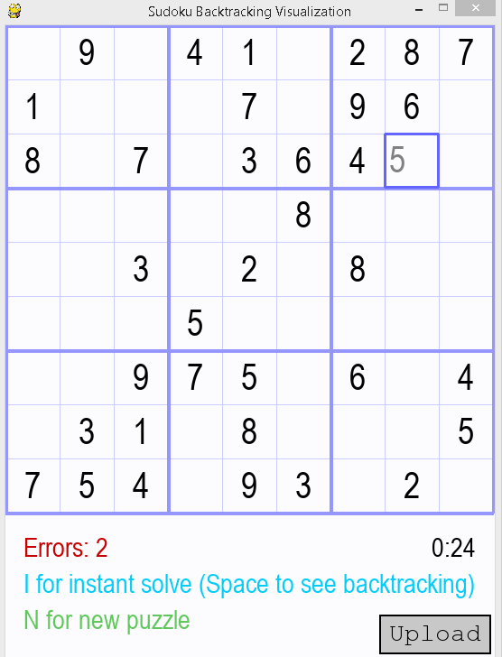

# Backtracking Visualed: Sudoku-Puzzle-Generator-&-Solver

Features:
- Fully playable game with a graphical user interface (GUI) 
- Auto generates puzzles as well as solves puzzles using backtracking algrorithm
- Can upload your own puzzle via a text file

Run the GUI.py file to play and test out the features. 

# Instructions
Selecting a box by clicking on it allows you to note a number in that box, you may press ENTER to confirm try and put that value into the puzzle or if you change your mind you can press another number or use DELETE to make that space empty again.

| Controls | Usage |
| ------ | ------ |
| I | instant completes puzzle with no animation or delay |
| Space | completes the puzzle but with an animation to visual how backtracking works |
| N | generate a new puzzle using an algorithm |
| Upload button | upload a txt file with 9x9 numbers to create a puzzle based off the file

  

